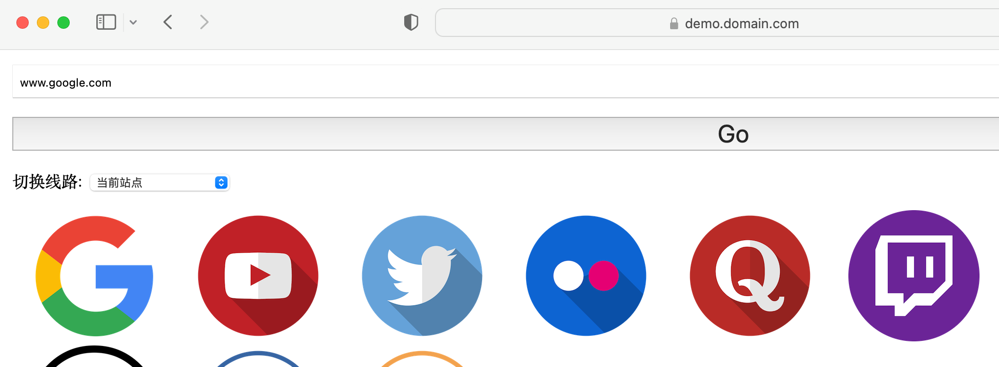
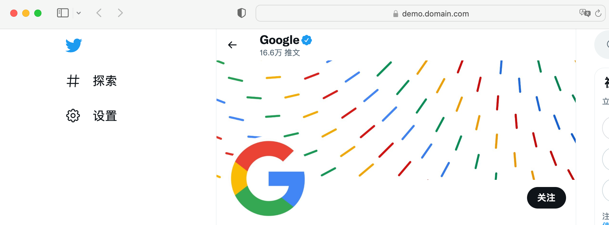

# Nginx 反向代理配置示例

这个示例采用了 docker-compose 进行演示，可能要求读者具备 docker-compose 的前置知识以及对应的开发环境。

假设你已经做好了准备工作，可以接着往下看了。不过，本文档主要介绍的是 nginx 配置，你也可以直接[跳转](#nginx-config)至配置详情。


## 使用 docker-compose 启动服务

首先，进入到 example 目录：

```
cd example
```

目录下可以看到 docker-compose.yaml 文件，这个是容器的配置。按照下面命令启动这些容器：

```
docker-compose up -d
```

随后，会启动 openrestry（可以理解为就是 nginx）容器和 jsproxy 容器。其中，openrestry 会侦听 443 端口。


## nginx-config

nginx 具体的配置如下：

```
access_log  /var/logs/access.log;
error_log  /var/logs/error.log;

server {
    listen 443 ssl http2;
    server_name demo.domain.com;

    ssl_certificate /certs/cert.pem;
    ssl_certificate_key /certs/key.pem;

    location / {
      proxy_set_header Host 127.0.0.1;
      proxy_pass http://jsproxy:8080;
    }
}
```

这个配置相应了域名为 demo.domain.com 的 HTTPS 请求，并且将所有请求通过反向代理，转发给了 jsproxy:8080 端口。

HTTPS 证书我使用的是自签名的版本，需要先在系统中信任这个证书（否则一会无法打开示例网站）。具体操作办法我以 MacOS 为例子，其他系统可以自己百度试试：

首先，找到证书文件，这里是`openresty/certs/cert.pem`，将它添加到钥匙串里面。

双击打开证书，并且信任该证书：


证书配置好以后，用浏览器上打开`https://demo.domain.com`，就能看到实现的效果：

> 注意，我演示机器可以访问 google.com，你是否能够打开 google.com，是和你运行 jsproxy 机器的网络配置有关的。

**首页**



**网站代理展示**


