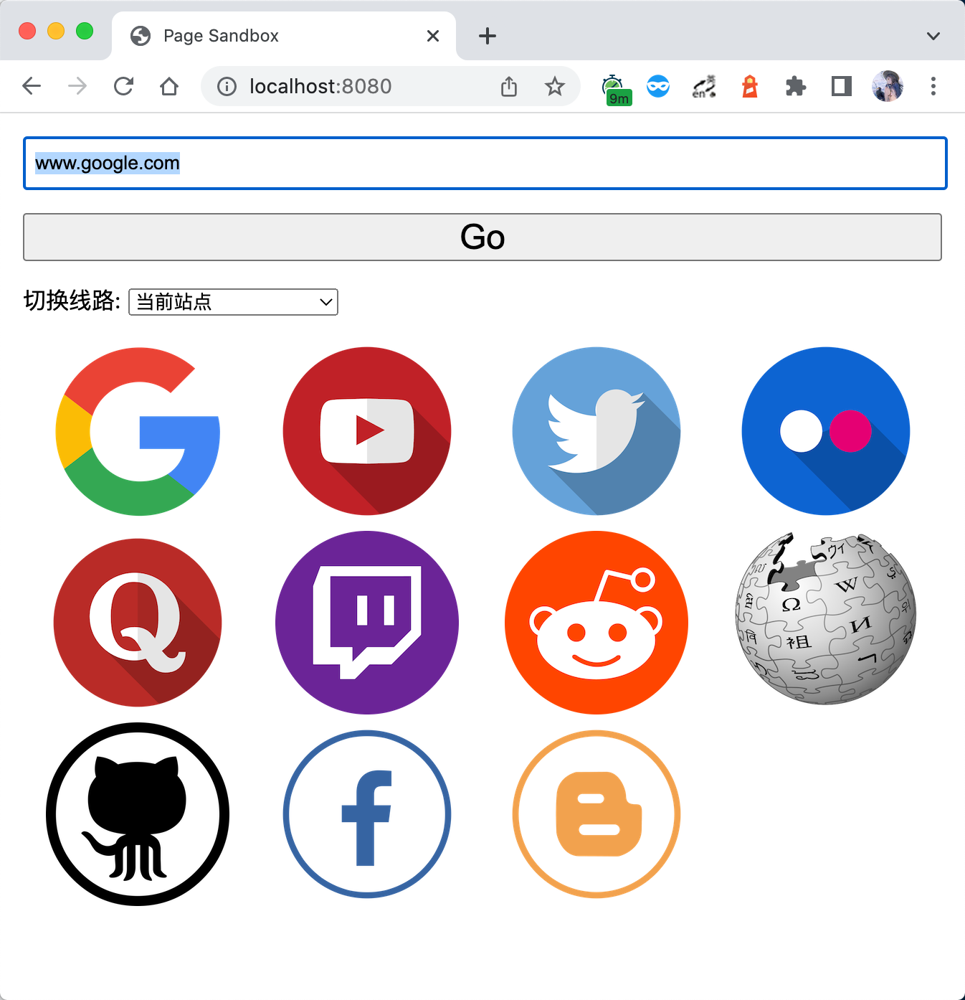
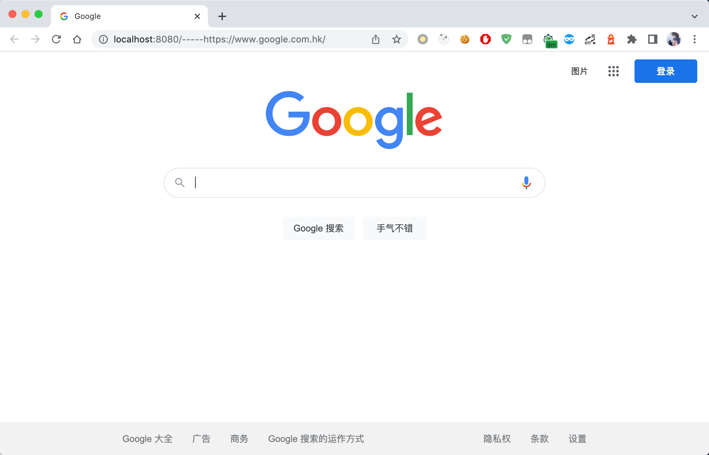
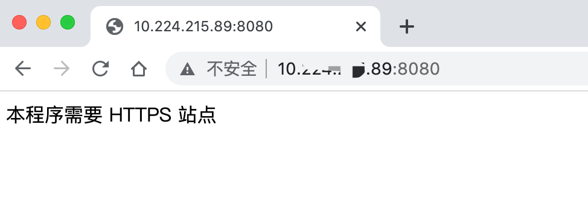

# jsprxy-docker

jsproxy 的 docker 版镜像，构建过程参考[jsproxy 自编译过程](https://github.com/EtherDream/jsproxy/blob/master/docs/setup.md)，可放心使用。

> 镜像支持 x86_64 和 arm/v8。

## 为什么要创建这个仓库

jsproxy 文档中提到的一键部署脚本所支持的系统太少，我常用的 MacBook 和树莓派都不能直接使用。另一方面，相较于直接部署到系统中，我更倾向于使用 Docker 来部署，于是就有了这个项目。

正如前文所提到的，目前支持 x86_64 和 arm/v8 两种架构，如果你需要更多架构支持，请给我留言。

## 使用方式

下载镜像：

``` sh
docker pull rxh1212/jsproxy
```

以上命令会根据当前环境自行下载对应架构的镜像。

接着，启动一个镜像。可采用 docker run ，docker compose 等等形式，以 docker run 为例：

``` sh
docker run -d  -p 8080:8080 --name jsproxy  rxh1212/jsproxy
```

然后就能看看效果了：

**http://localhost:8080**

> ⚠️：是否可以访问 google.com 等网站，决定于运行 jsproxy 的机器网络是否支持那些网站。jsproxy 本身不带 fq 能力哈～





jsproxy 使用了浏览器的 Service workers 能力。出于安全考量，Service workers 只能由 HTTPS 承载，毕竟修改网络请求的能力暴露给中间人攻击会非常危险。在 Firefox 浏览器的用户隐私模式，Service Worker 不可用。



但是，可以用前置 Nginx 服务进行反向代理，配置好证书以后一样可以正常访问。

> Nginx 反向代理配置请参考[这个文档](./example/nginx.md)

## 开发

本地开发阶段可使用以下命令进行构建，这个命令同时会启动一个容器供调试：

``` sh
docker run --rm -p 8080:8080 -it $(docker build -q .) sh
```